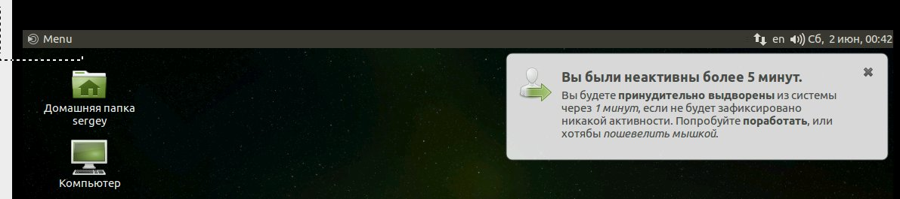

# xrdp-idle-killer
Slaps and kicks idling users logged through xrdp

Based on `idlekiller` bash script by @muru:
https://github.com/muru/scratchpad/tree/master/linux/idlekiller

## Installation
Install `xprintidle`:

	sudo apt-get install xprintidle

Copy:
- the script `xrdp-idle-killer.sh` to `/usr/local/bin/xrdp-idle-killer`,
- the `.upstart` file to `/etc/init/xrdp-idle-killer.conf`,
- the `.init.d` file to `/etc/init.d/xrdp-idle-killer`,
- the `.default` file to `/etc/default/xrdp-idle-killer`.

Start the Upstart service:

	# Ubuntu 14-
	sudo initctl reload-configuration

	sudo service xrdp-idle-killer start

Start the init.d service:

	# Ubuntu 16+
	sudo systemctl daemon-reload

	sudo service xrdp-idle-killer start

## Configuration
It doesn't support many options now. :)
You can set:

- The idle timeout using the variable `IDLE`. This is an integer in seconds. Default: `3600`.
- The frequency of checking using the sleep timeout variable `TIMEOUT`. Default: `15s`.
  Since this is passed to `sleep` as is, you can use syntax that your `sleep` will understand,
  such as 10m and 2h.
- The grace period after the warning is shown, using the `GRACE` variable. This is an integer in minutes. Default: `15`.
- The warning message subject using the `IDLE_SUBJECT` variable.
- The warning message text using the `IDLE_MESSAGE` variable. Sended through `notify-send`, support basic html tags.
- The warning message icon using the `IDLE_ICON` variable. Default: `system-log-out`.
- Command to execute to logout root in `LOGOUT_ROOT` variable. Default: `mate-session-save --logout-dialog`
- Command to execute to logout users in `LOGOUT_USER` variable. Default: `mate-session-save --force-logout`

To set them, create `/etc/default/xrdp-idle-killer` and set the variables in it.
The file is sourced, so `bash` syntax can be used.

I haven't added a way to exclude users from this yet.

## Logging
The script logs to `syslog` using the `XRDP-IDLE-KILLER` tag.

## How it looks
